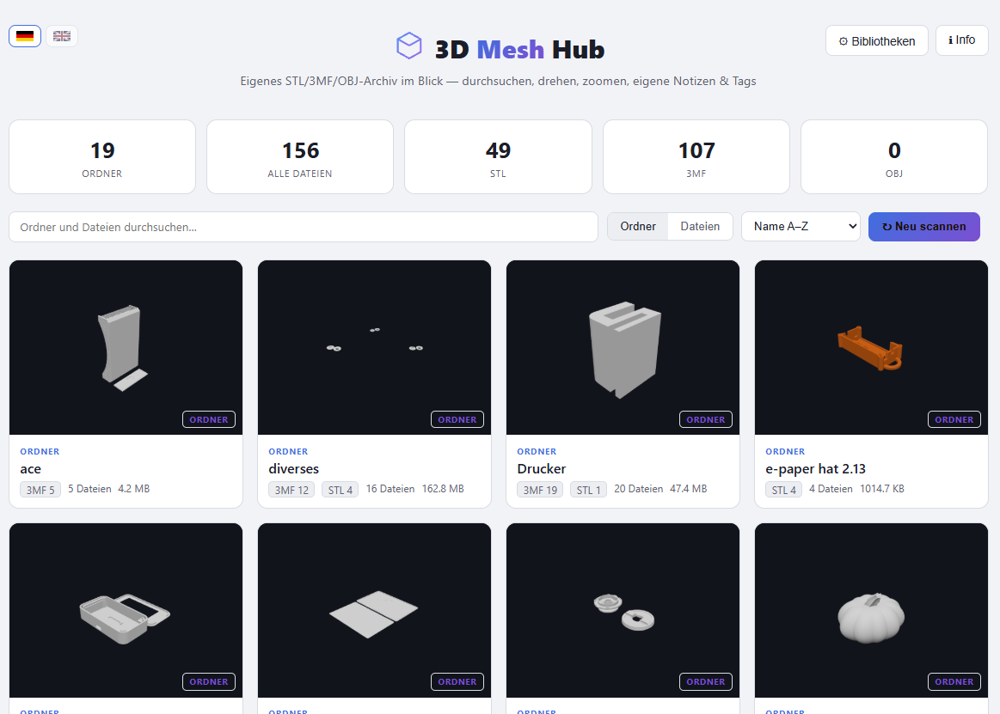
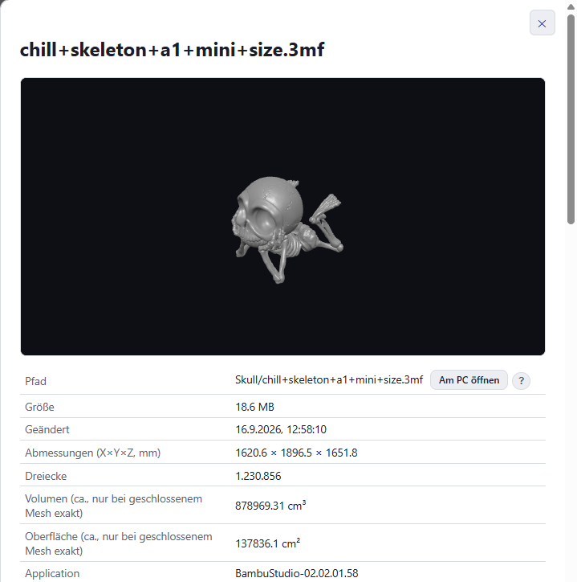
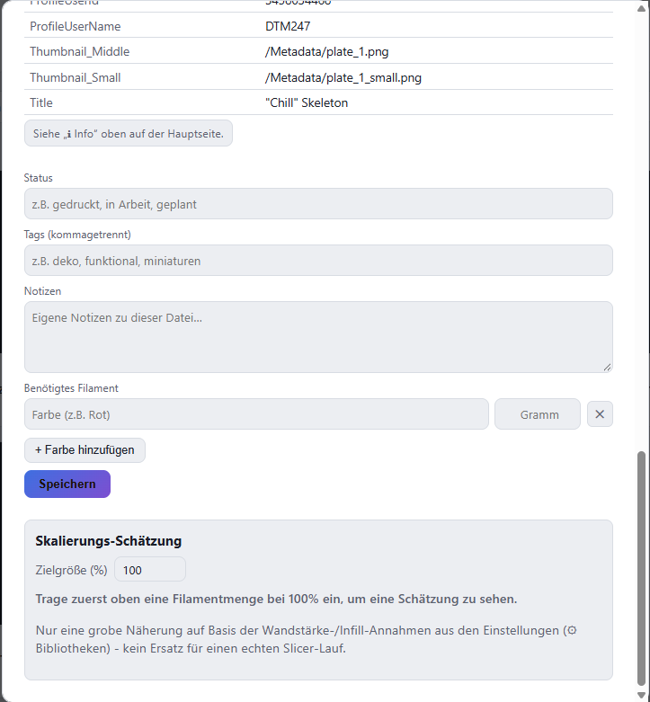

**Deutsche Version:** [README.md](README.md)

# 3D Mesh Hub

Local, self-hosted web app for managing your own STL/3MF/OBJ archive:
preview of the file including automatically extracted plus your own custom
info, free rotate/zoom in the 3D viewer (Three.js), folder overview with
server-rendered thumbnails.

Runs entirely locally in Docker — no uploads, no cloud, no registration.

## Screenshots

**Overview:** folder grid with thumbnails, format badges, and stat tiles.



**File detail:** 3D preview, path, size, dimensions, plus automatically extracted mesh geometry (triangle count, volume, surface area).



**Scaling estimate:** enter a target size and see the estimated filament usage for a scaled version of the file.



## Quick start

1. Docker Desktop installed? Then:
   ```
   cp .env.example .env
   ```
2. In `.env`, set the path to your 3D files folder (`DATA_ROOT`).
   Write Windows paths with forward slashes, e.g. `DATA_ROOT=D:/PrintData`.
3. Start:
   ```
   docker compose up --build -d
   ```
   **Note:** The image now also includes Chromium (for thumbnail
   generation) — the first build downloads more accordingly and the image
   is noticeably larger than before.
4. Open in your browser: http://localhost:3000
5. Click **"Libraries"** in the top right and add the desired subfolders
   within your data folder as a library — configurable per folder via the
   **"include subfolders"** checkbox. Then click **"Rescan"**.

If `DATA_ROOT` changes later, just update `.env` and run
`docker compose up -d` again (no rebuild needed for a plain path change).

## Why a folder in .env instead of picking it directly in the browser?

For security reasons, a running Docker container cannot mount an arbitrary
host folder afterwards. So: enter a (generously sized) root folder **once**
in `docker-compose.yml`/`.env` — the actual choice of which subfolders are
scanned as a "library" then happens entirely through the UI (like
Jellyfin/Plex).

## What is currently supported?

| Format | 3D preview | Thumbnail | Extracted metadata |
|---|---|---|---|
| STL (ASCII + binary) | Yes | Yes (server-rendered) | Triangle count, bounding box, approximate volume |
| 3MF | Yes | Yes (server-rendered) | Core 3MF metadata (title/creator/application etc.), detects existing slicer extras |
| OBJ | Yes | Yes (server-rendered) | Vertex/face count, bounding box (no volume, since OBJ can also contain non-triangular faces) |

STEP (a CAD B-rep format, not a triangle mesh) is deliberately **not**
supported: in the hobby/community 3D-printing space this archive is built
for, practically only STL/3MF/OBJ get shared — STEP is a pure CAD source
format and would require its own CAD kernel (e.g. OpenCascade) for
conversion, with no test case to justify it.

In addition, every file has its own freely editable fields: **status**
(e.g. printed/planned), **tags**, and **notes** — independent of the file
format, stored in a separate SQLite database (its own Docker volume) and
preserved across a rescan.

## Interface

- **Folder view** (default): cards per folder with a thumbnail of the first
  renderable model inside, format badges, file count, total size. Clicking
  a card drills into that folder's files.
- **File view**: flat list of all scanned files, same search/sort toolbar.
- Clicking a file opens an overlay with the 3D viewer, extracted metadata,
  and your own notes/tags/status form.
- Stat tiles at the top (folders, total files, STL/3MF/OBJ counts).
- Floating indicator bottom right ("Loading thumbnails… X/Y") while the
  visible cards are still loading thumbnails.

## Thumbnails: how they are created

The first time a file tile is opened, a headless Chromium instance
(Puppeteer, installed in the container) renders the model once on an
internal page (`public/render.html`) and stores the result as a PNG in the
`app-db` volume (`/app/db/thumbnails/`) — later requests are served directly
from that cache. No bulk rendering during a scan (that would drastically
slow down scanning for large archives); instead it's on-demand ("lazy") on
first view.

**Known pitfall (already fixed):** the first version ran on Alpine Linux
and failed with `Error creating WebGL context` — Alpine's Chromium package
doesn't have reliable software WebGL support (SwiftShader) for headless
rendering in a container. Since this fix, the runtime uses Debian
(`node:20-slim`) with explicit software-rendering flags (`--use-gl=swiftshader`,
`--enable-unsafe-swiftshader`) and a larger `/dev/shm` (`shm_size: 1gb` in
`docker-compose.yml`), since a too-small `/dev/shm` is a common second cause
of Chromium crashes in containers.

If it still doesn't render: `docker compose logs -f` shows the exact error
message; `docker compose exec 3d-mesh-hub chromium --version` checks
whether the binary even starts.

**Second pitfall (also fixed):** when switching to Debian, only the runtime
stage was changed at first, while the build stage (where `better-sqlite3`
is compiled natively) stayed on Alpine — the native binding then didn't
match the glibc runtime (`libc.musl-x86_64.so.1: cannot open shared object
file`, container crash-loop right at startup). Both stages in the Dockerfile
now consistently use `node:20-slim`.

**Third pitfall (workaround, not a Docker problem):** Three.js's bundled
3MF loader can't handle multi-part 3MF files (typical for Bambu
Studio/OrcaSlicer, when objects live in separate model parts and are only
referenced by component) — symptom: `Cannot read properties of undefined
(reading 'mesh')`. This is a known limitation of the standard loader
itself. `scripts/patch-3mfloader.js` patches this automatically during the
Docker build (looks up referenced object IDs across all model parts instead
of only the current one). **Best effort:** the patch checks before applying
whether the expected original code is still present, and skips itself with
a warning in the build log rather than breaking the build, in case a later
three.js version changes the internal structure. If `reading 'mesh'` errors
still show up after a rebuild: search the build log for `3MFLoader-Patch`
to see whether it was applied.

**Fourth pitfall (also fixed):** `Waiting failed: ...ms exceeded` kept
occurring for the same files on every page load — the cause was a missing
concurrency limit: a folder view with many cards requests all thumbnails at
once, and software WebGL (SwiftShader) is too slow to handle that in
parallel. Fix: `server/thumbnails.js` now has a queue (max. 2 concurrent
renders), dedupes parallel requests for the same file, and remembers failed
files for 10 minutes instead of retrying them on every request.

**Sixth pitfall (fully fixed):** for large files (several tens of MB), the
detail view could briefly freeze the whole page completely (no
scrolling/clicking possible). Cause: three.js's STL/3MF loaders parse
synchronously on the browser's main thread. Fix: parsing now runs in a Web
Worker (`public/js/parse-worker.js`) — it loads the file, parses it
(ZIP/XML/binary data → vertex arrays) and sends only the finished numeric
arrays back to the main thread via `postMessage` (as transferable objects,
essentially without copy cost), which then builds the actual Three.js
objects from them in milliseconds. The page stays fully responsive while
loading. For server-side thumbnails, the size limit (see below) still kicks
in above 40 MB (default) — real test data shows that software rendering
(SwiftShader, no access to the host GPU inside the container) reliably
fails above ~47 MB, even with a high timeout. An optional GPU passthrough
for thumbnails (e.g. `/dev/dri` on Linux hosts with an Intel/AMD iGPU) is
noted as a later, opt-in feature — but by nature won't work on Windows/Mac
with Docker Desktop and has to be fixed at container startup (no runtime
toggle possible in the UI).

**Important for diagnostics:** the log error message now includes the file
path and file size, not just the internal hash — so with
`docker compose logs -f` you can directly see which file is affected.
There's also a size limit (`THUMB_MAX_SIZE_MB`, default 150 MB): files above
that immediately get the "No preview available" placeholder instead of
running into a 45-second timeout on every attempt — software rendering
without a GPU (SwiftShader) often simply can't handle very large/complex
models in that time. The limit is adjustable in `.env`.

**Fifth pitfall (also fixed):** the 3D viewer in the detail overlay could
overflow past its frame into the text below. Cause: the container size was
measured while the overlay was still invisible (`display:none`), which
resulted in 0×0 and made the viewer fall back to a wrong default value
(480×360px). Fix: reordered the frontend logic (overlay is made visible
first, then rendered), a second re-measurement after the next frame as a
safety net, and `overflow:hidden` plus a forced 100% canvas size via CSS as
a last safety net.

## Experimental: testing GPU acceleration for thumbnails

By default, the app renders thumbnails via software (SwiftShader) — this
works everywhere, guaranteed, but eventually becomes too slow for
large/complex files (see the size limit above). If you have an NVIDIA GPU
and GPU access already works under Docker Desktop for other containers
(e.g. Frigate, other CUDA workloads), you can try real GPU acceleration:

1. In `.env`: set `GPU_ACCEL=true`
2. Start with both compose files:
   `docker compose -f docker-compose.yml -f docker-compose.gpu.yml up --build -d`

**Genuinely experimental:** NVIDIA GPU access in Docker Desktop (WSL2) is
well proven for video decoding/CUDA, but whether the same setup works
just as reliably for actual WebGL rendering by Chromium is far less
documented. Hence: a separate override file instead of part of the normal
config (a system without a matching GPU wouldn't even start with
`docker-compose.gpu.yml`), and an automatic fallback to software rendering
in `server/thumbnails.js` if Chromium's GPU startup fails (see log:
"GPU startup failed, falling back to software rendering").

## "Open on PC": open the file's location in Explorer (Windows, optional)

The detail view has an **"Open on PC"** button that highlights the file in
Windows Explorer, or opens it in its associated default program (e.g. your
slicer).

**Why a one-time local setup is needed:** for security reasons, browsers
can't launch local programs from a regular website - current Chrome/Edge
versions even block `file://` links from `http(s)` pages outright ("Not
allowed to load local resource"). The fix is a custom URL protocol
(`meshhub://`), the same mechanism `vscode://` or `zoommtg://` use - this
needs a small, free helper script installed once on your PC.

**Setup (Windows only, ~30 seconds):**
1. In the app, click the `?` next to "Open on PC" -> download link.
2. Unzip, right-click `install.ps1` -> "Run with PowerShell".
3. Done. Runs entirely in your own Windows user context (`HKCU`) - **no admin
   rights needed**, no real installation, just a registry entry (fully
   reversible any time). Source is open under `windows-helper/` in the repo.

Without this setup the button simply doesn't appear (no absolute
`DATA_ROOT` path set in `.env`), or does nothing when clicked. macOS/Linux
are not currently supported.

## Filament amount tracking

The detail form lets you record the filament amount needed per file — as a
list of color + grams (not just a single total), so multi-color prints can
be represented correctly ("how much red do I still need?"). The total
amount is shown automatically as a sum. At least one row always remains;
empty rows are ignored when saving.

## Architecture (brief)

- **Backend:** Node.js + Express, reads the read-only mounted data folder,
  serves the REST API and the static frontend files.
- **Database:** SQLite (better-sqlite3), in its own Docker volume `app-db` —
  kept separate from the data folder so nothing in your own archive gets
  modified. Thumbnails live in the same volume.
- **Frontend:** vanilla JS + Three.js (STLLoader/OBJLoader/3MFLoader +
  OrbitControls), no build pipeline needed. Deliberately **no** print-bed
  grid in the viewer — we don't know how the creator oriented the object in
  detail, and a grid would suggest a wrong "bottom" side. **Axis correction
  (2026-09-26):** in the 3D-printing world, STL/3MF are almost always Z-up
  (Z = print height), while three.js is Y-up — this is corrected uniformly
  (pure rotation, no assumption about individual object orientation). This
  does **not** apply to OBJ: there, Y-up vs. Z-up is inconsistent depending
  on the export tool, and a blanket correction would orient some files
  incorrectly instead of correctly — a known limitation.
- **Thumbnails:** puppeteer-core + Chromium (installed via `apk` in the
  image), renders `public/render.html` headless and reads the `<canvas>` as
  a PNG.
- **Distribution:** one container per user, each running locally on their
  own machine (no central server) — intended as an open-source tool for
  everyone, not just for personal homelab use.

## Status / next steps

- [ ] Verify Chromium/Puppeteer rendering in the real container
- [ ] Multi-level folder navigation (currently: one level, direct parent folder)
- [ ] License decision (proposal: MIT, similar to Filament-Lager) + create repo
      on Forgejo/GitHub
